# 🌻 Plants vs Zombies - Phiên Bản Đơn Giản Bằng C++ & SDL2

🎮 **Giới thiệu**  
Đây là phiên bản mô phỏng trò chơi **Plants vs Zombies** nổi tiếng, được lập trình bằng **C++** và sử dụng thư viện **SDL2** cho đồ họa, âm thanh và xử lý sự kiện. Game mang lại trải nghiệm thủ thành vui nhộn với cơ chế trồng cây, bắn zombie quen thuộc.

---

## 🚀 Tính Năng Nổi Bật
- 🎨 **Đồ họa 2D đơn giản, thân thiện**:
  - Sử dụng các hình ảnh icon Peashooter, Sunflower, Walnut, Zombie...
  - Hiển thị thanh Sun, item bar, xẻng, màn hình chiến thắng/thua.
    
- 🔊 **Âm thanh sống động với SDL_mixer**:
  - Nhạc nền xuyên suốt game.
  - Hiệu ứng: Bắn đạn, nhặt sun, zombie ăn cây, dùng xẻng đào cây.
    
- 🌞 **Cơ chế gameplay**:
  - Thu thập Sun để trồng cây.
  - Ba loại cây: **Peashooter**, **Sunflower**, **Walnut**.
  - Zombie di chuyển và tấn công cây.
  - Xẻng cho phép đào cây nếu trồng nhầm.
  - Hệ thống hồi chiêu cho từng loại cây.
    
- 🎯 **Quản lý màn chơi**:
  - Nhiều màn chơi với độ khó tăng dần.
  - Khi thắng: Hiển thị màn hình "Level Completed".
  - Khi thua: Hiển thị "Game Over".
  - Nhấn Enter để chuyển màn hoặc chơi lại.

---

## 📥 Cài Đặt & Chạy Game
1. Clone hoặc tải project về máy.
2. Đảm bảo bạn đã cài đặt:
   - **SDL2**
   - **SDL2_image**
   - **SDL2_mixer**
   - **SDL2_ttf**
3. Build project bằng IDE (Visual Studio, VSCode, CodeBlocks...) hoặc Makefile.
4. Chạy file thực thi có tên `Pvz.exe`
---

## 🕹️ Hướng Dẫn Chơi
- **Bắt đầu game**: Nhấn `Enter`.
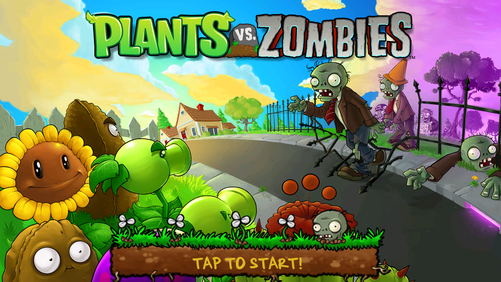

- **Thu thập Sun**: Click vào Sun rơi hoặc Sun do Sunflower tạo ra.
  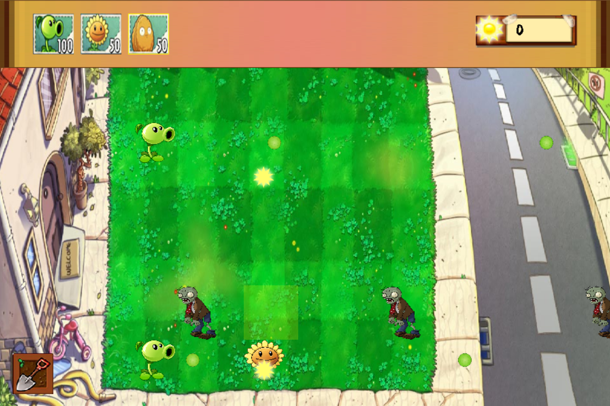
- **Trồng cây**:
  - Chọn cây trên thanh công cụ.
  - Click vào ô lưới để trồng (đủ Sun và hết hồi chiêu).
   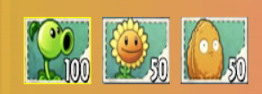 
- **Dùng xẻng**:
  - Click vào icon xẻng (góc dưới trái) ➜ Click vào cây muốn đào.
  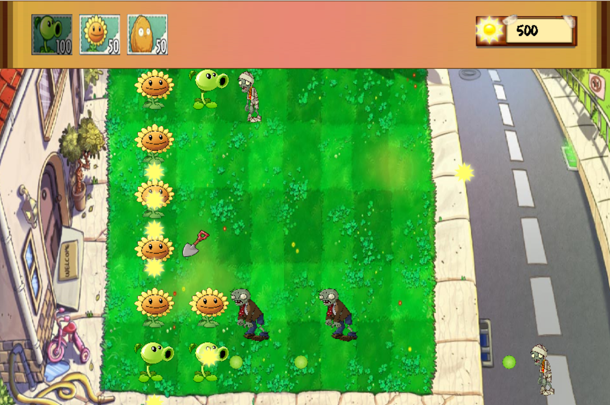   
- **Chiến thắng**: Tiêu diệt hết zombie của màn chơi.
 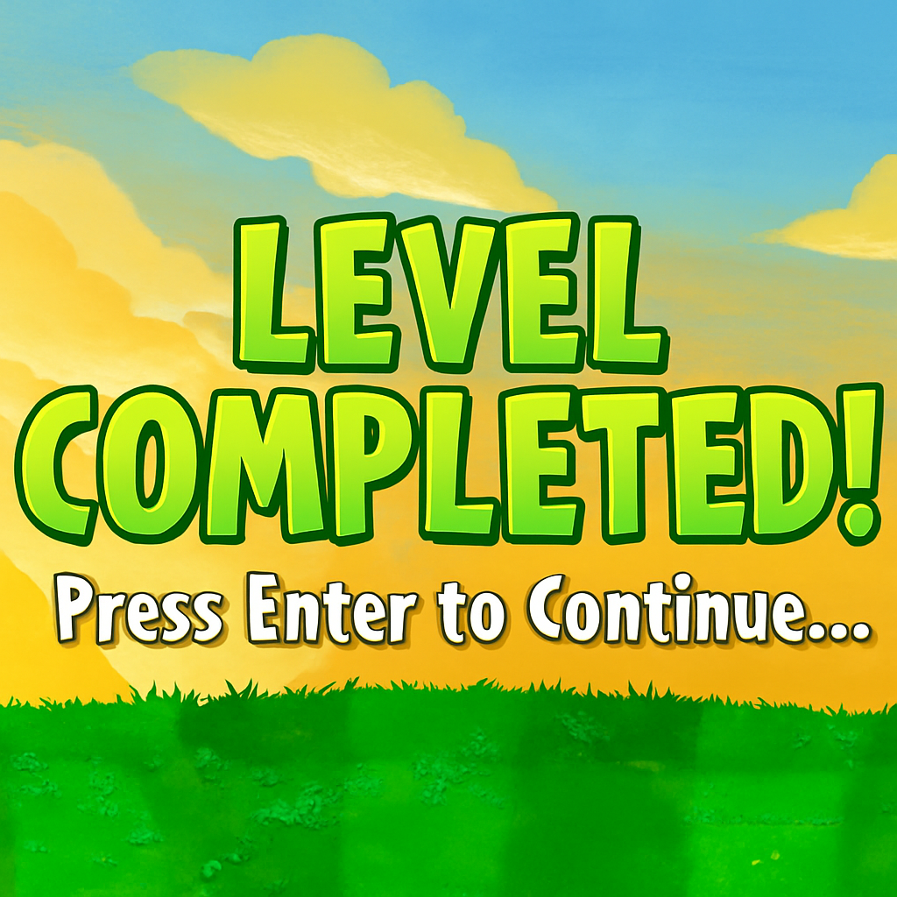
- **Thua cuộc**: Khi zombie vượt qua hàng phòng thủ.
  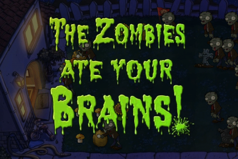

---

## ⏱️ Tính Năng Game
- 🌻 **Cây trồng**:
  -Có 3 loại cây trong game:

|                                                                             | Tên cây	     | Chức năng      | Cách chon |
|-----------------------------------------------------------------------------|--------------|------------------------------------------------------------------------------------------------------------------------------|-------------------|
|   | Peashooter	  | Mỗi lần bắn một đậu vào zombie.|Bấm 1 để chọn|                                                             
|     | Sunflower	   | Tạo thêm mặt trời để trồng cây.|Bấm 2 để chon|                                                                                               
| 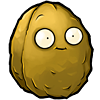          | Wallnut	    | Chịu được nhiều phát ăn của zombie để bảo vệ các cây khác.|Bấm 3 để chọn|      
- 🧟‍♂️ **Zombie**:
 
| Zombie                                         | Chức năng                         |
|------------------------------------------------|------------------------------------|
| 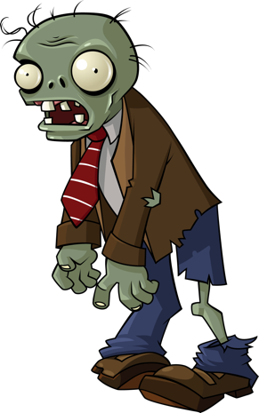 | Ăn cây và tấn công nhà của bạn     |
| 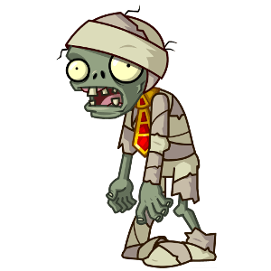 | Hình dạng của Zombie khi thấp máu  |                                                                                                   
- 🛠️ **Hệ thống xẻng**: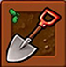
  - Đào cây khi cần thay đổi chiến thuật.
    
- 🌞 **Sun Bar**:
  - Hiển thị số lượng Sun hiện có.
    
- ⏳ **Hồi chiêu**: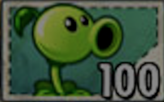
  - Mỗi cây có thời gian hồi chiêu riêng, icon mờ khi đang hồi.

## 🔊 Danh Sách Âm Thanh
| Sự kiện             | Âm thanh           |
|---------------------|--------------------|
| Nhạc nền            | `Loonboon.mp3`     |
| Bắn đạn             | `firepea.mp3`      |
| Dùng xẻng           | `shovel.mp3`       |
| Nhặt Sun            | `sun_click.mp3`    |
| Zombie ăn cây       | `zombie_eating2.mp3` |
---
## ✅ Kế Hoạch Mở Rộng
- Thêm nhiều loại zombie & cây trồng mới.
- Cải thiện AI zombie.
- Thêm menu chính và lưu tiến trình.
- Hiệu ứng animation mượt hơn.

---

## 📜 Giấy Phép
Dự án mang tính học tập và phi thương mại, mô phỏng lại gameplay của Plants vs Zombies.
